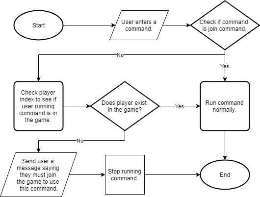
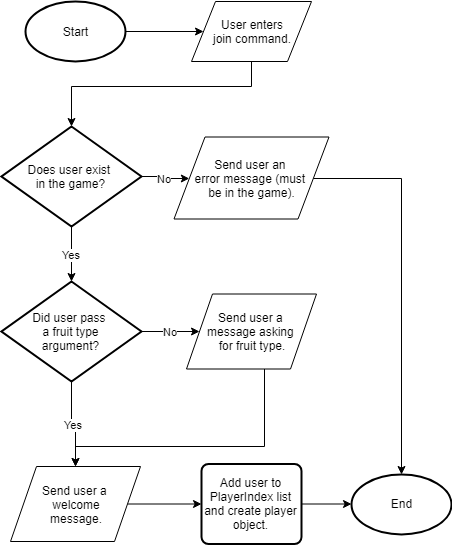
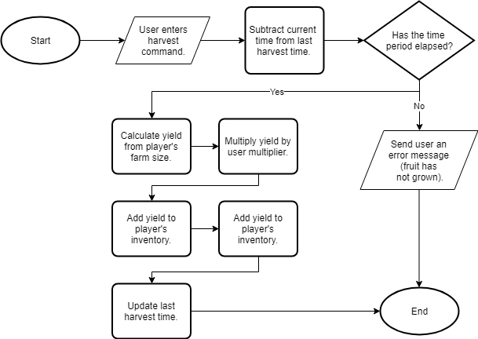
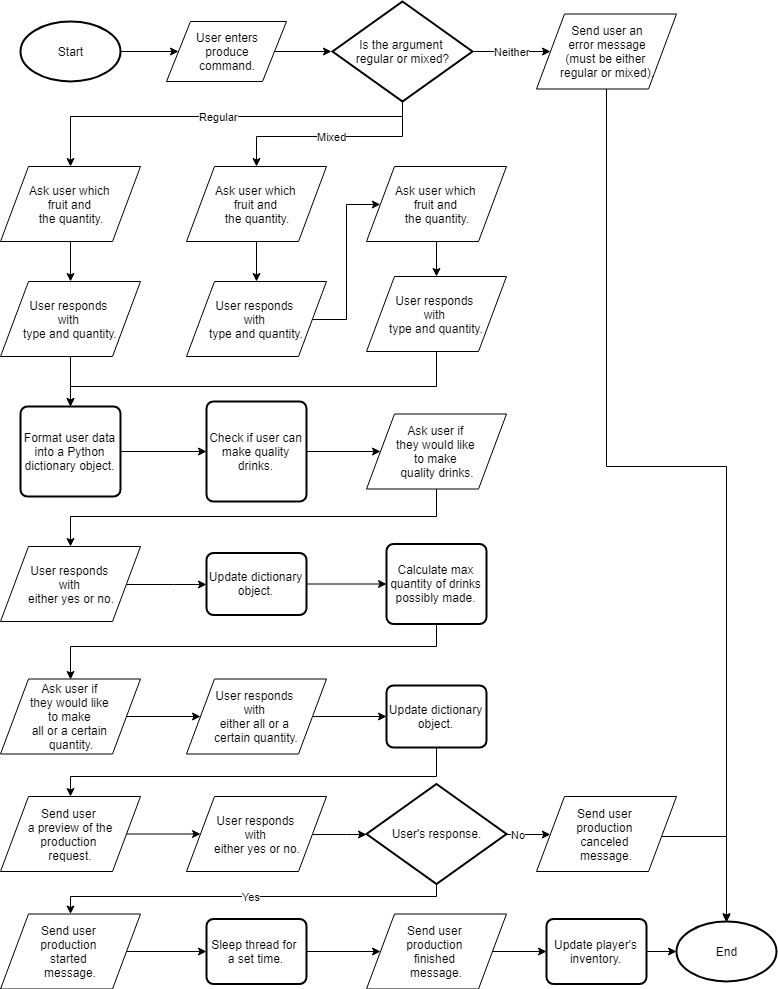
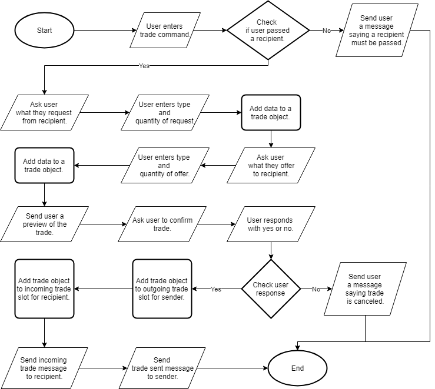
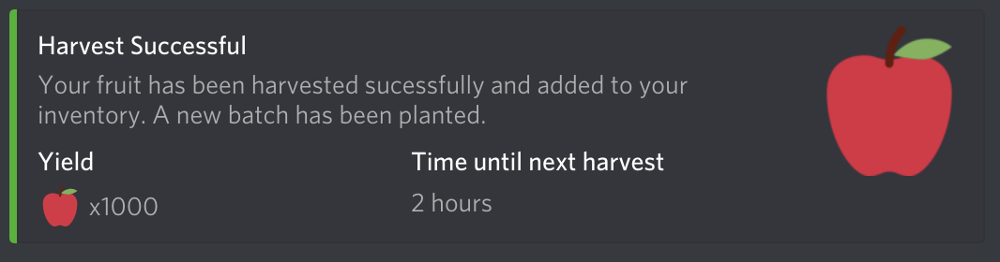
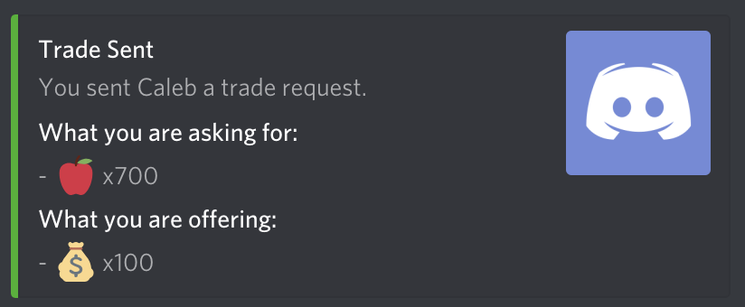
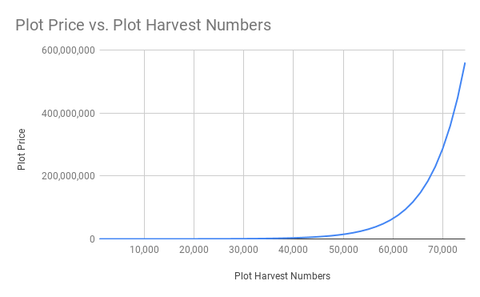

# Fruit Tycoon

## Criterion B

### Explanation of game

- The goal is to accrue as much profit as possible.

- This is accomplished by harvesting fruit, turning it into produce and selling it for profit.

- More profitable drinks can be made from combining two different fruits together, but obtaining these fruits is only possible by trading with other players; so making negotiations and agreements will be left up to the player to organize.

### Command List

#### Admin

| Command      | Parameter | Description                                                           |
| ------------ | --------- | --------------------------------------------------------------------- |
| RemovePlayer | {id}      | Remove a specified player from the game.                              |
| Reset        | None      | Reset the entire game back to starting values and remove all players. |
| Ping         | None      | Ping the bot to see if it is responsive.                              |
| Reboot       | None      | Restart the bot.                                                      |
| Exit         | None      | Stop the bot.                                                         |

#### User

| Command     | Parameter                                   | Description                                                                                                    |
| ----------- | ------------------------------------------- | -------------------------------------------------------------------------------------------------------------- |
| Join        | {type - optional}                           | Send player the welcome message, create a configuration file for them and add them to the player list.         |
| Harvest     | None                                        | Harvest the planted fruits once they reached maturity.                                                         |
| Produce     | {type, quantity, fruit1, fruit2 - optional} | Make a specific drink. Player can make other single berry drinks that are not their own type (through trades). |
| Sell        | {item, quantity}                            | Sell a specific item (raw fruit, any produce).                                                                 |
| Trade       | {quantity, player}                          | Send another player a trade offer. Player can only trade selected (at join) fruit type.                        |
| Profile     | None                                        | Show the user's profile in direct messages.                                                                    |
| Upgrade     | {stat}                                      | Upgrade/unlock a certain upgrade.                                                                              |
| Leaderboard | None                                        | Show the top players on the current leaderboard.                                                               |

### Flowcharts

#### Events

##### All Commands

##### Join Command

##### Harvest Command

##### Produce Command

##### Trade Command

### UML Diagram

### Messages (interaction)

##### Harvest Message

##### Profile Message

##### Incoming Trade Message

##### Outgoing Trade Message

### Fruit types & Starting Variables

| Fruit  | Variation     |
| ------ | ------------- |
| Apple  | Default       |
| Banana | To be decided |
| Grape  | To be decided |

### Upgrades

#### Multiplier

##### Value

##### Price

##### Graph

#### Plot Size

##### Value

##### Price

##### Graph

| Type                | Unlock price | Unlock name                | Price per Item | Refinery time | Fruit-Juice Ratio |
| ------------------- | ------------ | -------------------------- | -------------- | ------------- | ----------------- |
| Fruit               | Free         | n/a                        | 0.375 (3/8)    | 0             | n/a               |
| Regular Juice       | 36,000       | Refinery                   | 1              | 2 hours       | 2:1               |
| Quality Juice       | 300,000      | Marketing                  | 1.5            | 3 hours       | 2:1               |
| Mixed Juice         | 500,000      | Overclocked Refinery       | 2              | 4 hours       | 2:1:1             |
| Quality Mixed Juice | 1,600,000    | Carbon fiber mixing blades | 4              | 6 hours       | 2:2:1             |

### File structure

### Test Plan

| Action                                          | Test                                                                                                                                                                                                                  |
| ----------------------------------------------- | --------------------------------------------------------------------------------------------------------------------------------------------------------------------------------------------------------------------- |
| Saving and reading user data from file.         | Running the join command once should create the file. Check in the player_data directory for a matching “{user_id}.json” file. Run command again to test loading file and show that the player cannot join again. |
| Harvesting only once within a set time period.  | Run the harvest command twice. Once should work successfully. Second should fail with an explanation.                                                                                                                 |
| Refining raw materials.                         | Run the produce command, check profile before and after to ensure the items are being removed from inventory.                                                                                                         |
| Sending trades.                                 | Run the trade command, check if recipient gets the trade added to their incoming and sender gets it added to their outgoing trade slot.                                                                               |
| Accepting and declining trades.                 | Run the trade command to receive a trade. On a different account, run the accept/decline command and ensure (via profile command) the items are properly added/removed from inventory.                                |
| Sending leaderboard at certain time.            | Set time a few minutes in the future and wait until that time is reached to see if leaderboard is sent.                                                                                                               |
| Sending leaderboard with a command.             | Run leaderboard command to see if leaderboard is sent.                                                                                                                                                                |
| Help command sends message to user.             | Run help command to see if user receives help message.                                                                                                                                                                |
| Command arguments handling extreme cases.       | Input no value, different type values, negative values and large values into all commands’ parameters.                                                                                                                |
| Multiplier, size and utilities can be upgraded. | Run the upgrade command with enough money to purchase the upgrade. Check if it worked by running the profile and harvest commands.                                                                                    |
| All other commands are functional.              | Run other commands to ensure no errors are passed and they are functional.                                                                                                                                            |
