# Fruit Tycoon

## Criterion C

#### File Structure

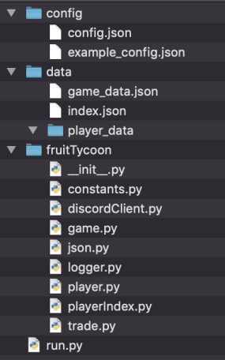

Json and logger classes were added to help with File IO and debugging. The idea of using a TradeIndex class was scrapped, as the Trade objects were dependent on the Player class and thus could be stored within the player’s in_trade array.

#### External Sources

##### Discord.py (Rapptz)

This module was imported and used mainly in the DiscordClient class. Its purpose is to facilitate connections between the Discord application and my code.

On line 24, the DiscordClient class is defined and inherits the class discord.ext.commands.Bot. This allows me to build upon the default class, which provides me connection to Discord.

##### Colorlog (Clements)

This module allowed easier identification of messages in the developer console. Useful for debugging purposes.

#### Profile Command

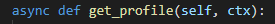

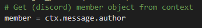

Set member variable equal to discord.Member object of message author.

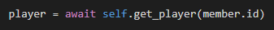

Load message author's player file into player variable.

Get user’s thumbnail from discord.Member object.

Set profile_embed equal to the return of the function create_profile_embed(), which is a member of the Player class.

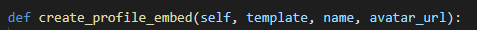

Format profile template embed (Discord-supported rich text format) stored in game_data.json with the player’s data.

Return two discord.Embed objects. One for the main profile, and one for the trade section.

#### Trading System

##### Send Trade

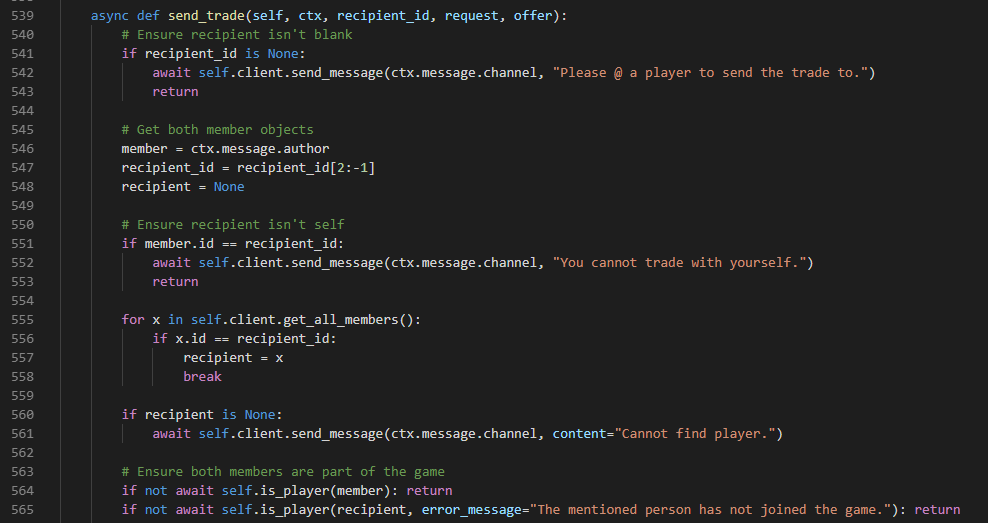

Lines 540-565 conduct the necessary checks to ensure the player can run the command. Such as:

Ensuring the correct arguments are passed,

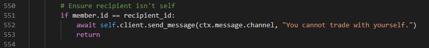

Handling odd cases (e.g. trading with yourself),

the inability to find the player,

Ensuring the member is part of the game (has run the join command).

Loop through both the recipient and sender’s incoming and outgoing trade slots respectively to ensure space in both.

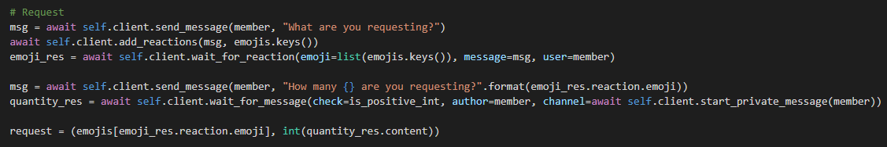

Interact with the player via Discord reactions, e.g. offer message:

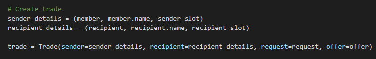

Create trade object with tuples (Python immutable data type) containing the details of the players.

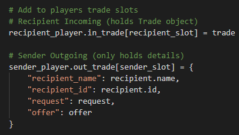

Add the trades to the player’s slots.

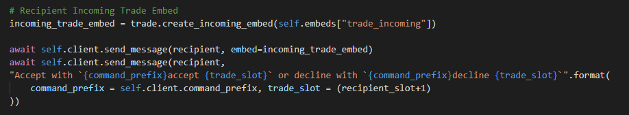

Send the recipient player a notification.

##### Accept Trade

Ensure user entered trade_slot argument as an int, and it is between 1-4.

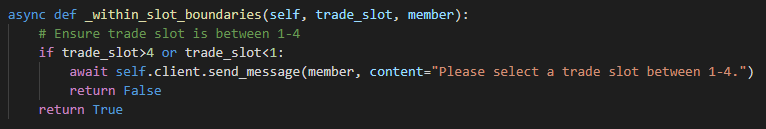

Boundaries check is done in this function.

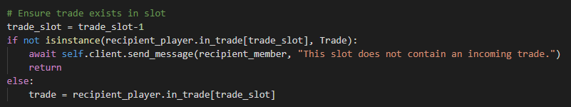

Ensure the trade exists in the trade_slot by matching instance type.

Remove trade from both players slots, and upgrade inventories with the offer and request.

#### Production System

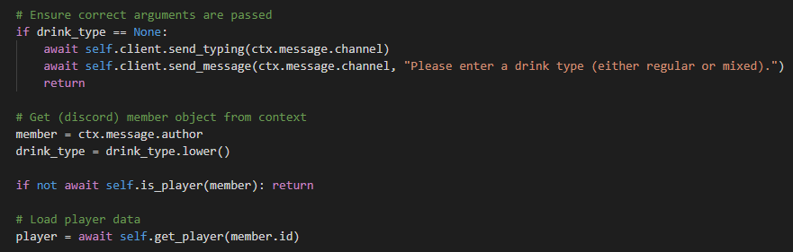

Similar to the trading system, ensure correct arguments were entered by the user, load the  
discord.Member object, check the player exists in the game and load their data if so.

Ensure the user’s farm_level is greater than the default value, i.e. has upgraded their farm level at least  once. This allows access to the produce command.

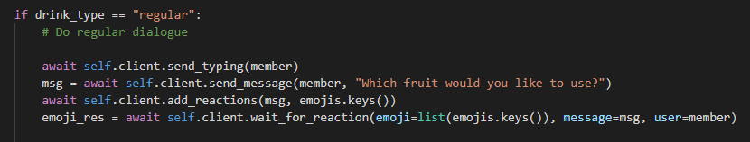

If the user wants to make regular drinks, ask which fruit they would like to use.

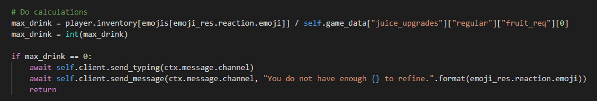

Calculate the number of drinks the player can make by dividing the quantity of fruit chosen in the  previous step in their inventory by the cost of regular drinks (defined in game_data.json).

If the player has upgraded their farm level at least twice, ask them if they would like to make quality  drinks, requiring a longer duration to make. This was added to allow the player to still make less  profitable drinks quicker if they had upgraded to quality drinks.

If the user chose mixed drinks, repeat the process done with regular drinks twice to get the two fruit  combination the user wants to use.

Calculate the max number of drinks that can be made by dividing the selected fruits’ quantity by the  fruits’ requirement, then selecting the minimum value out of the two fruits.

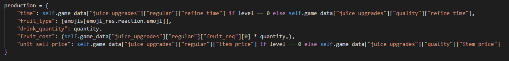

Format the aquired data from the user with the calculated data in a Dictionary (Python data type). Both  versions of this code exist for regular and mixed drinks, with slight variations to accommodate for the  extra fruit type. Defining this Dictionary makes the following code only need to be written twice.

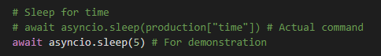

Once the user has entered all the information, the commented line would be used to sleep that Thread  (unique to the player) of code for the duration of the time remaining. For demonstration, the time was  set to 5 seconds.

Update the player’s inventory, removing the fruits and adding the gained money.

Then save the player’s updated information to their file.

#### Leaderboard System

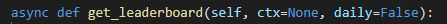

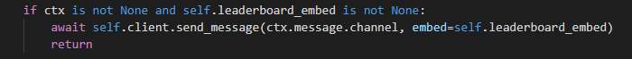

If a leaderboard already exists for that day, send that one.

Otherwise:

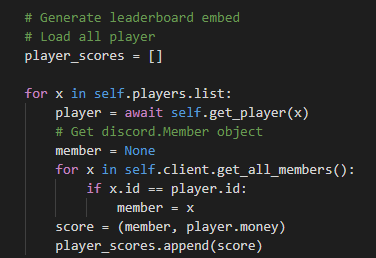

Create an array, iterate through all players getting the discord.Member objects and Player objects. Combine the discord.Member objects with the player’s integer money value into a tuple and append that to the array.

Sort the array in descending order, based on the player’s money, using Python’s default sorting algorithm: Timsort. This is a hybrid between merge and insertion sort and is designed for real-world data.

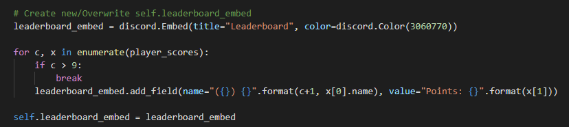

Iterate through the first 10 players, create the leaderboard message and assign it to the leaderboard variable.

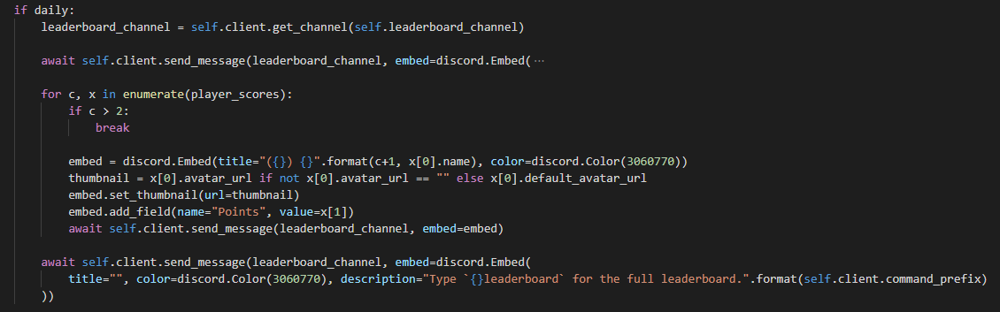

If this function is being ran from the leaderboard loop (below), iterate through the top 3 players and add send a different leaderboard message in the leaderboard channel.

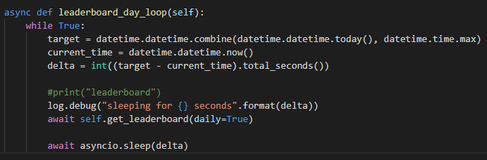

Calculates how many seconds until midnight, runs the leaderboard command, then sleeps the Thread until that time has elapsed

#### File IO of Players & Trades

Trade objects are only stored in a player’s in_trade array. Thus, they need to be saved along with the Player object.

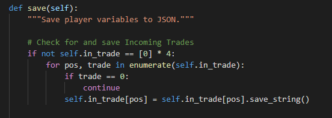

Iterate through all items in the in_trade array, ignoring empty slots (0s) and saving full slots.

save_string() is called on existing Trade objects which runs the following function:

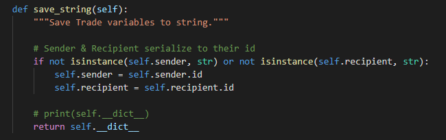

This function converts the Trade object’s sender and recipient values from discord.Member objects to discord ID strings, then returns the JSON representation of that instance as a string.

The player’s object is converted to a JSON string representation using **\_\_dict\_\_**, then saved by creating a Json object and dumping the string.

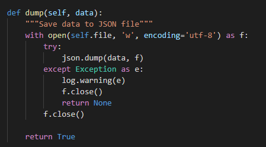

This Json function deals with file IO, such as creating a new file if it does not exist or updating existing ones.

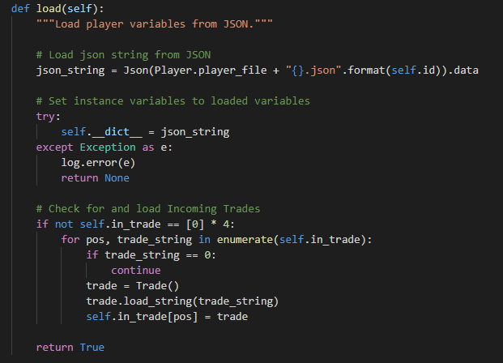

Loading is the same procedure in reverse. Where the trades are loaded with the function:

**Word Count**: 956

#### Bibliography:

Rapptz (n.d.). *Rapptz/discord.py*. \[online] GitHub. Available at: https://github.com/Rapptz/discord.py/ \[Accessed 20 Mar. 2019].

Clements, S. (n.d.). *borntyping/python-colorlog*. \[online] GitHub. Available at: https://github.com/borntyping/python-colorlog \[Accessed 20 Mar. 2019].
